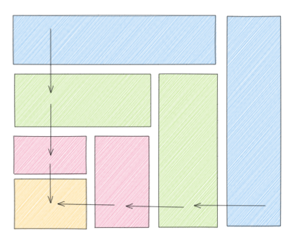

# Clean Architecture on Azure.
Practical implementation of Robert C. Martin's Clean architecture.

### Table of Contents
- Building applications in conformity with Robert C. Martin's clean architecture principles.
- Explanation of the repository
- Deploy to azure with one command
- Optional: Deploy the frontend to azure static webapps

### Building applications in conformity with Robert C. Martin's clean architecture principles.
There's so much knowledge in his book, that I will not try to replicate all of those insights in this repo. The main takeaways from this repo should be the following:
  - Entities are high-level objects at the core of an organization and are, in general, not very likely to change on a frequent basis (think of describing a "cab" entity for a company like Uber).
  - Usecases provide a more detailed goal. For example list all the available cabs in the city of New York.
  - Interface adaptors: Provide a way to make the usecase framework independent.
  - Frameworks and Drivers. This part contains the lower level details about which database to use and what tool to use for our frontend.

The interesting part is that dependencies are all pointing towards higher level components. That is, entities and usecases should know nothing about the frameworks we are using. We simply don't care and want to postpone this decision as long as possible. That sounds weird right? As an architect you might be used to designing everything upfront, but actually it makes sense. Having this flexibility enables us to quickly modify our application such that it always adheres to what is, at that time, the best solution to the problem.
The way we achieve this is by defining interfaces and dependency inversion.

 

### Explanation of the repository

#### backend/cabrenter
- main.py: Contains the FASTAPI application with endpoints
- entities: Define the most high-level objects central to the business case.
- use_cases: Define how the right cabs are selected for a customer (simply based on city)
- data_structures:  Define data requests and responses
- interfaces: Specify how objects/classes should behave and enable the dependency inversion by letting the usecase define the interface and let the interface adaptors be responsible for the implementation.
- repositories: Have knowledge about frameworks and drivers and implement the lowest level features.

  

Looking at the above figure and morphing it into a different representation (i.e. the figure below), something should become visible. Which is: Entities know nothing about use-cases. usecases know nothing about interface adaptors and interface adaptors know nothing about frameworks and drivers! Great!
 

### Deploy to azure with one command
Open a terminal in the root folder and run `make clean && make`

### Optional: Deploy the frontend to azure static webapps
Steps to upload the frontend:
1) open `./frontend/src/store/index.js` and replace the existing urls (there should be two of them) with the urls from your azure web app which you deployed in the previous step in resource group `clean_architecture_setup`.   
2) push the current directory to your own github account.
3) Go to the azure portal portal.azure.com
4) Search for `Static web apps` and hit `+ Create`
5) Fill in the required fields and select Github as a source under Deployment Details. Login in to github if not already done so by clicking the Warning message or Sign in with Github button.
6) Authorize azure static webapps in the popup screen
7) Choose your organization, repository and branch
8) Select Vue.js as build Presets
9) for app location specify: `/frontend`
10) api location: `api`
11) output location `dist`
12) Hit review and create and after that hit create.
13) Navigate to the url as mentioned in the overview and you are ready to go!

.